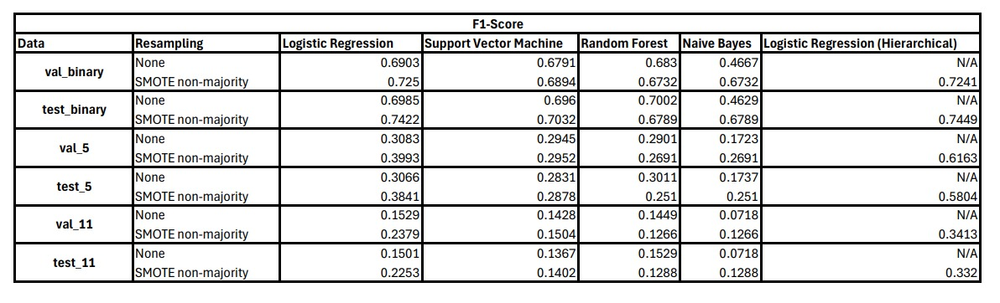

## _Explainable Detection of Online Sexism_ (EDOS)

> **Team**: `UP_Wale` \
> **Team Number**: 36
> 
> **Team Members**: Bhav Beri (2021111013), Divij(2021101001), Maharnav Singhal(2021115001)

----

# Interim Report

## Problem Statement

This project focuses on developing explainable models for detecting online sexism, addressing the limitations of existing tools that provide broad, high-level classifications without interpretability. The goal is to build more accurate models capable of offering fine-grained classifications for sexist content from various platforms. By explaining why content is sexist, these models improve trust, transparency, and usability for both users and moderators, contributing to safer and more equitable online spaces.

## Datasets and Analysis

Upon initial examination of the data split, it became apparent that class imbalance could pose a significant challenge in completing the task. Specifically, the training set contains nearly four times as many non-sexist samples compared to sexist samples. This imbalance could lead to a model that is biased toward the more prevalent class, potentially resulting in higher accuracy but adversely affecting the F1-score and overall prediction quality.

To address this issue, we have attempted to use re-sampling techniques. We employed the Synthetic Minority Oversampling Technique (SMOTE) to artificially increase the number of samples for the minority class. Our baseline models were trained twice for comparison: once without re-sampling and once with it, allowing us to evaluate the impact of this technique on model performance.

In addition to class imbalance, we identified specific data points that informed our data cleaning process. For instance, consider the following sample:

This sample consists solely of a URL, which is unlikely to provide meaningful information for a machine learning model. Similarly, many other sentences included URLs that would degrade the prediction quality, prompting us to remove all URLs from the text during the cleaning phase.

During our exploration of the dataset, we also encountered numerous samples containing placeholders like [URL] and [USER]. For example:

[USER] quietly looking at her with big eyes and lip trembling

These placeholders disrupt the flow of the sentence. Initially, we attempted to remove all text within square brackets, only to discover sentences completely enclosed in brackets. As a result, we cpnfined our approach to selectively remove just [USER] and [URL], ensuring that we did not eliminate meaningful data in the process.

Considering these, we wrote a complete data cleaning pipeline to preprocess the data for different models. This data cleaning pipeline was very important as the textual data, as described above, has some noise and irrelevant information, which should be removed before feeding it to the model. The data cleaning pipeline includes the following steps:
Here are the pipeline steps in brief when the `process_data` function is called from the `clean_data` module file:

1. **Data Loading**:
   - The data is loaded from a CSV file using `pandas.read_csv`.
   
2. **Label Mapping Creation**:
   - Two mappings are created: `category_mapping` for 5-way classification and `vector_mapping` for 11-way classification using the `create_label_mappings` function.

3. **Text Cleaning and Preprocessing**:
   - The `clean_text` function preprocesses text data by:
     - Removing URLs, special tags, and non-alphanumeric characters.
     - Tokenizing and lemmatizing text.
     - Splitting the dataset into `train`, `validation (val)`, and `test` sets based on the `split` column.

4. **Task-specific Data Preparation**:
   - For each task ('binary', '5-way', and '11-way'):
     - Texts and labels are prepared using `prepare_data`.
     - Text is concatenated back to form sentences.
     - Labels are generated based on the task (binary, category, or vector).
   
5. **TF-IDF Vectorization**:
   - A `TfidfVectorizer` is used to convert the processed text into TF-IDF feature vectors.
     - It uses a custom `Lemmatizer` as the tokenizer.
   
6. **SMOTE Resampling (Optional)**:
   - If `use_smote=True`, SMOTE is applied to the training data to address class imbalance.
     - The resampled texts and labels are returned.

7. **Dataset Packaging**:
   - The processed and vectorized data for `train`, `val`, and `test` sets are packaged into a dictionary for each task.
     - If SMOTE is applied, this is also indicated in the dataset.
   
8. **Return Data**:
   - The processed datasets for all tasks (`binary`, `5-way`, `11-way`), along with `category_mapping` and `vector_mapping`, are returned for further use.

## Evaluation Metrics

For the classification tasks, we have chosen the following evaluation metrics:
1. **Accuracy**: The proportion of correctly classified instances.
2. **Macro F1 Score**: The unweighted average of the per-class F1 scores.Interim Report

## Baselines

As explained in our proposal, the first task was to run some of the basic baselines, so below are details for those ones:

Here’s the explanation for why each model was chosen as a baseline for the Explainable Detection of Online Sexism (EDOS) task:

1. **Logistic Regression**:  
   Logistic Regression serves as a simple yet effective baseline for both binary and multi-class classification tasks. It is favored due to its straightforward implementation and interpretability, making it an ideal starting point for benchmarking more complex models. By using logistic regression, we can easily understand the decision boundaries for sexism classification and gauge the initial performance with minimal computational resources.

2. **Naive Bayes**:  
   Naive Bayes is a probabilistic classifier based on Bayes' Theorem and assumes independence between features. This model is chosen for its efficiency in high-dimensional spaces, especially in text classification tasks. It is useful in this context because it can quickly provide a baseline for classifying sexist content by leveraging simple word-frequency-based features, making it a good fit for tasks where words are treated as independent predictors.

3. **Support Vector Machine (SVM)**:  
   SVM is selected as a baseline because of its strong performance in handling high-dimensional data, like text, and its ability to find optimal decision boundaries between classes. For both binary and multi-class tasks, SVM’s margin-maximizing property allows it to perform well on imbalanced datasets, a common issue in sexism detection. Its kernel trick also enables the exploration of non-linear relationships in the data, adding versatility in the classification task.

4. **Random Forest**:  
   Random Forest, an ensemble learning method, is chosen for its robustness and ability to handle overfitting, particularly in cases of complex feature interactions. It combines the predictive strength of multiple decision trees and works well with both binary and multi-class classification. Additionally, Random Forest provides feature importance scores, helping to identify the key predictors of sexist content, thus contributing to the explainability aspect of the task.

Below are the results for the above defined baselines, without using SMOTE (Synthetic Minority Oversampling Technique) as well as with SMOTE:

### Logistic Regression

#### Binary Classification (SMOTE: False)
- **Training**: Accuracy: 0.8511, Macro F1: 0.7444  
- **Validation**: Accuracy: 0.8240, Macro F1: 0.6903  
- **Test**: Accuracy: 0.8267, Macro F1: 0.6985  

#### 5-way Classification (SMOTE: False)
- **Training**: Accuracy: 0.8223, Macro F1: 0.4096  
- **Validation**: Accuracy: 0.7900, Macro F1: 0.3083  
- **Test**: Accuracy: 0.7877, Macro F1: 0.3066  

#### 11-way Classification (SMOTE: False)
- **Training**: Accuracy: 0.8069, Macro F1: 0.2180  
- **Validation**: Accuracy: 0.7840, Macro F1: 0.1529  
- **Test**: Accuracy: 0.7808, Macro F1: 0.1501  

---

#### Binary Classification (SMOTE: True)
- **Training**: Accuracy: 0.9065, Macro F1: 0.9065  
- **Validation**: Accuracy: 0.7960, Macro F1: 0.7250  
- **Test**: Accuracy: 0.8035, Macro F1: 0.7422  

#### 5-way Classification (SMOTE: True)
- **Training**: Accuracy: 0.9643, Macro F1: 0.9639  
- **Validation**: Accuracy: 0.7205, Macro F1: 0.3993  
- **Test**: Accuracy: 0.7000, Macro F1: 0.3841  

#### 11-way Classification (SMOTE: True)
- **Training**: Accuracy: 0.9891, Macro F1: 0.9889  
- **Validation**: Accuracy: 0.6930, Macro F1: 0.2379  
- **Test**: Accuracy: 0.6837, Macro F1: 0.2253  

---

#### Summary & Analysis

When SMOTE was not applied, the binary classification model performed decently on the test set, achieving an accuracy of 0.8267 and a Macro F1 score of 0.6985. However, the performance deteriorated significantly for more fine-grained classification tasks, especially in the 11-way classification, where the Macro F1 score dropped to 0.1501 on the test set.

With SMOTE applied, the training performance of all models improved significantly due to the balanced dataset, but this led to overfitting. The binary classification test results saw only a slight improvement in the Macro F1 score (0.7422), while the 5-way and 11-way classifications showed a clear drop in performance on the test set, with the Macro F1 scores decreasing to 0.3841 and 0.2253, respectively.

### Naive Bayes

#### Binary Classification (SMOTE: False)
- **Training**: Accuracy: 0.7732, Macro F1: 0.4967  
- **Validation**: Accuracy: 0.7655, Macro F1: 0.4667  
- **Test**: Accuracy: 0.7650, Macro F1: 0.4629  

#### 5-way Classification (SMOTE: False)
- **Training**: Accuracy: 0.7581, Macro F1: 0.1756  
- **Validation**: Accuracy: 0.7570, Macro F1: 0.1723  
- **Test**: Accuracy: 0.7578, Macro F1: 0.1737  

#### 11-way Classification (SMOTE: False)
- **Training**: Accuracy: 0.7573, Macro F1: 0.0718  
- **Validation**: Accuracy: 0.7570, Macro F1: 0.0718  
- **Test**: Accuracy: 0.7575, Macro F1: 0.0718  

---

#### Binary Classification (SMOTE: True)
- **Training**: Accuracy: 1.0000, Macro F1: 1.0000  
- **Validation**: Accuracy: 0.8145, Macro F1: 0.6732  
- **Test**: Accuracy: 0.8175, Macro F1: 0.6789  

#### 5-way Classification (SMOTE: True)
- **Training**: Accuracy: 1.0000, Macro F1: 1.0000  
- **Validation**: Accuracy: 0.7775, Macro F1: 0.2691  
- **Test**: Accuracy: 0.7755, Macro F1: 0.2510  

#### 11-way Classification (SMOTE: True)
- **Training**: Accuracy: 1.0000, Macro F1: 1.0000  
- **Validation**: Accuracy: 0.7730, Macro F1: 0.1266  
- **Test**: Accuracy: 0.7775, Macro F1: 0.1288  

---

#### Summary & Analysis

Without SMOTE, the Naive Bayes model struggled with all tasks, particularly for fine-grained classifications. While the binary classification model achieved a moderate accuracy of 0.7650, the Macro F1 score of 0.4629 shows its limited ability to handle imbalanced classes. The performance sharply declined for the 5-way and 11-way classification tasks, with the Macro F1 scores dropping to 0.1737 and 0.0718, respectively.

When SMOTE was applied, training results drastically improved due to the balanced data, with a perfect accuracy and Macro F1 score of 1.0000 across all tasks. However, this also resulted in overfitting, as reflected by the performance drop on the validation and test sets. For instance, the binary classification test accuracy improved to 0.8175, but the gains in Macro F1 (0.6789) were moderate. For 5-way and 11-way classifications, the test set scores remained low, with Macro F1 scores of 0.2510 and 0.1288, indicating poor generalization to complex classification tasks.

Overall, while SMOTE improved training performance, the model did not generalize well to the more nuanced classification tasks, similar to the behavior observed with Logistic Regression.

### Support Vector Machine (SVM)

#### Binary Classification (SMOTE: False)
- **Training**: Accuracy: 0.9536, Macro F1: 0.9326  
- **Validation**: Accuracy: 0.8240, Macro F1: 0.6791  
- **Test**: Accuracy: 0.8307, Macro F1: 0.6960  

#### 5-way Classification (SMOTE: False)
- **Training**: Accuracy: 0.8793, Macro F1: 0.5860  
- **Validation**: Accuracy: 0.7920, Macro F1: 0.2945  
- **Test**: Accuracy: 0.7890, Macro F1: 0.2831  

#### 11-way Classification (SMOTE: False)
- **Training**: Accuracy: 0.8518, Macro F1: 0.3412  
- **Validation**: Accuracy: 0.7845, Macro F1: 0.1428  
- **Test**: Accuracy: 0.7833, Macro F1: 0.1367  

---

#### Binary Classification (SMOTE: True)
- **Training**: Accuracy: 0.9880, Macro F1: 0.9880  
- **Validation**: Accuracy: 0.8245, Macro F1: 0.6894  
- **Test**: Accuracy: 0.8303, Macro F1: 0.7032  

#### 5-way Classification (SMOTE: True)
- **Training**: Accuracy: 0.9987, Macro F1: 0.9987  
- **Validation**: Accuracy: 0.7860, Macro F1: 0.2952  
- **Test**: Accuracy: 0.7855, Macro F1: 0.2878  

#### 11-way Classification (SMOTE: True)
- **Training**: Accuracy: 0.9999, Macro F1: 0.9999  
- **Validation**: Accuracy: 0.7825, Macro F1: 0.1504  
- **Test**: Accuracy: 0.7817, Macro F1: 0.1402  

---

#### Summary & Analysis

Without SMOTE, the SVM model performed well for binary classification, achieving a test accuracy of 0.8307 and a Macro F1 score of 0.6960. However, the performance dropped for the 5-way and 11-way classifications, with the test set showing significantly lower Macro F1 scores of 0.2831 and 0.1367, respectively. These results indicate that while the model handled the binary task relatively well, it struggled with finer-grained classifications.

With SMOTE applied, training performance improved considerably, but overfitting became evident. For binary classification, the test accuracy and Macro F1 scores remained relatively stable at 0.8303 and 0.7032, respectively. However, for 5-way and 11-way classifications, the improvement in training performance did not translate to the test set, where the Macro F1 scores were 0.2878 and 0.1402, respectively.

In conclusion, while SMOTE helped improve training results, it did not generalize well to the test set, especially for more complex classification tasks. The binary classification task showed minor improvements with SMOTE, but the performance gains diminished as the classification tasks became more granular.

### Random Forest

#### Binary Classification (SMOTE: False)
- **Training**: Accuracy: 0.9999, Macro F1: 0.9999  
- **Validation**: Accuracy: 0.8285, Macro F1: 0.6830  
- **Test**: Accuracy: 0.8340, Macro F1: 0.7002  

#### 5-way Classification (SMOTE: False)
- **Training**: Accuracy: 0.9999, Macro F1: 0.9996  
- **Validation**: Accuracy: 0.7895, Macro F1: 0.2901  
- **Test**: Accuracy: 0.7947, Macro F1: 0.3011  

#### 11-way Classification (SMOTE: False)
- **Training**: Accuracy: 0.9999, Macro F1: 0.9998  
- **Validation**: Accuracy: 0.7875, Macro F1: 0.1449  
- **Test**: Accuracy: 0.7933, Macro F1: 0.1529  

---

#### Binary Classification (SMOTE: True)
- **Training**: Accuracy: 1.0000, Macro F1: 1.0000  
- **Validation**: Accuracy: 0.8145, Macro F1: 0.6732  
- **Test**: Accuracy: 0.8175, Macro F1: 0.6789  

#### 5-way Classification (SMOTE: True)
- **Training**: Accuracy: 1.0000, Macro F1: 1.0000  
- **Validation**: Accuracy: 0.7775, Macro F1: 0.2691  
- **Test**: Accuracy: 0.7755, Macro F1: 0.2510  

#### 11-way Classification (SMOTE: True)
- **Training**: Accuracy: 1.0000, Macro F1: 1.0000 
- **Validation**: Accuracy: 0.7730, Macro F1: 0.1266 
- **Test**: Accuracy: 0.7775, Macro F1: 0.1288  

---

#### Summary & Analysis

Without SMOTE, the Random Forest model exhibited near-perfect performance on the training set across all tasks, indicating significant overfitting. While the model performed reasonably well on the binary classification task (Test Accuracy: 0.8340, Macro F1: 0.7002), its performance declined in the 5-way and 11-way classifications, with the test Macro F1 scores dropping to 0.3011 and 0.1529, respectively.

When SMOTE was applied, the training results remained perfect, but this led to a general drop in test performance. For binary classification, the test Macro F1 dropped slightly to 0.6789. For more granular tasks, the 5-way and 11-way classification models still struggled, with test Macro F1 scores of 0.2510 and 0.1288, respectively. The poor performance on fine-grained tasks suggests that Random Forest, even with SMOTE, is not effectively handling class imbalances in multi-class settings.

Overall, while SMOTE slightly improved generalization for binary classification, it did not significantly boost performance for more complex tasks.

## Hierarchical Classification

We also explored the idea of hierarchical classification to improve the model's performance on fine-grained tasks. The hierarchical approach involves breaking down the multi-class classification problem into a series of binary or multi-class subproblems, each focusing on a subset of classes. By training models sequentially on these subproblems, we aim to improve the overall classification accuracy and interpretability of the model.

The hierarchical classification pipeline consists of the following steps:
- **Task-specific Data Preparation**: The data is prepared for each subproblem based on the hierarchical structure.
- **Model Training**: Models are trained sequentially on each subproblem using the prepared data.
- **Prediction**: The models are used to predict the labels for the test data, and the final predictions are aggregated to obtain the hierarchical classification results. Firstly binary classification is done and then over it 5-way classification is done, and finally 11-way classification is done.

### Classification Model Evaluations with SMOTE Applied: **False**

#### Binary Classification Model
- **Validation Set:**
  - **Accuracy:** 79.50%
  - **F1 Score:** 72.41%
  
- **Test Set:**
  - **Accuracy:** 80.60%
  - **F1 Score:** 74.49%

---

#### 5-Way Classification Model
- **Validation Set:**
  - **Accuracy:** 89.05%
  - **F1 Score:** 61.63%
  
- **Test Set:**
  - **Accuracy:** 88.10%
  - **F1 Score:** 58.04%

---

#### 11-Way Classification Model
- **Validation Set:**
  - **Accuracy:** 85.80%
  - **F1 Score:** 34.13%
  
- **Test Set:**
  - **Accuracy:** 84.75%
  - **F1 Score:** 33.32%

## All Results & Comparison of Results with the Reference Paper

| Sub-Task | Reference Paper F1 Scores | Our Best F1 Scores |
|----------|----------------------------|--------------------|
| Binary Classification | 0.5191 | 0.7449 |
| 5-Way Classification | 0.4200 | 0.5804 |
| 11-Way Classification | 0.2128 | 0.3332 |

## Transformer

In the transformer-based code for sexism classification, the model is fine-tuned for three classification tasks: binary, 5-way, and 11-way sexism classification. Here's a concise breakdown:

1. **Dataset Preparation**: The input texts (sexism-related content) and labels are processed into datasets, with tokenization handled by a pre-trained BERT tokenizer. Sentences are tokenized, padded, and converted into BERT-compatible formats (input IDs and attention masks).

2. **Model Architecture**: The model uses a pre-trained BERT to extract features from the input text. A dropout layer and a linear classification layer are added to classify the outputs into respective categories (binary, 5-way, 11-way).

3. **Training**: The model is fully fine-tuned on sexism data for each classification task using cross-entropy loss and the AdamW optimizer. Training involves backpropagation, weight updates, and monitoring performance using validation data.

4. **Evaluation**: After training, the best model based on validation F1 score is saved. Finally, the model's performance is evaluated using accuracy, F1 score, precision, and recall on a test dataset to assess how well it detects and classifies sexist content.

### Results

#### Binary Classification
- **Best Model Saved:** Epoch 2
- **Train (Epoch 5):** Loss: 0.4101, Accuracy: 80.82%, Macro F1: 80.44%
- **Val (Epoch 5):** Loss: 0.6158, Accuracy: 72.45%, Macro F1: 48.82%
- **Test Results:**
  - Loss: 0.6126
  - Accuracy: 70.75%
  - Macro F1: 51.65%
  - Macro Precision: 53.66%
  - Macro Recall: 52.24%

#### 5-Way Classification
- **Best Model Saved:** Epoch 1
- **Train (Epoch 5):** Loss: 1.2568, Accuracy: 44.20%, Macro F1: 38.43%
- **Val (Epoch 5):** Loss: 0.9660, Accuracy: 70.65%, Macro F1: 17.49%
- **Test Results:**
  - Loss: 0.9465
  - Accuracy: 73.00%
  - Macro F1: 18.59%
  - Macro Precision: 19.23%
  - Macro Recall: 20.52%

#### 11-Way Classification
- **Best Model Saved:** Epoch 4
- **Train (Epoch 5):** Loss: 1.7148, Accuracy: 42.32%, Macro F1: 37.50%
- **Val (Epoch 5):** Loss: 1.1406, Accuracy: 72.10%, Macro F1: 7.06%
- **Test Results:**
  - Loss: 1.1985
  - Accuracy: 71.47%
  - Macro F1: 7.72%
  - Macro Precision: 8.67%
  - Macro Recall: 8.30%

## Future Work

1. Our future work consists of working with deep learning models such as Transformers while utilizing the knowledge gained from baseline models such as utilizing re-sampling techniques and heirarchical classification instead of direct classification.
2. We also intend to explore this heirarchical classification with a beam search approach which would allow us to give a better result for our 11-way classification task.
3. Ensembling methods are also something we intend to explore for the use case of our project.
4. As an optional expansion to the current project, we plan to explore the potential for adapting our approaches to other languages. This could involve:
    1. Investigating transfer learning techniques
    2. Trying out various techniques, like adding a translation encoder before our initial model, or doing translation first, and then trying sexism detection.
5. As part of understanding how our deep learning models are learning the task, we intent to apply interpretability techniques such as probing.
