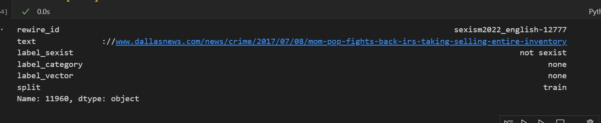

## _Explainable Detection of Online Sexism_ (EDOS)

> **Team**: `UP_Wale` \
> **Team Number**: 36
>
> **Team Members**: Divij (2021101001), Bhav Beri (2021111013), Maharnav Singhal(2021115001)

---

# Final Report

## Problem Statement

This project focuses on developing explainable models for detecting online sexism, addressing the limitations of existing tools that provide broad, high-level classifications. The goal is to build more accurate models capable of offering fine-grained classifications for sexist content from various platforms. By leveraging interpretability techniques, we aim to also look into the inner workings of the models to understand how they make predictions and identify the features that contribute to these predictions. While sexism detection solutions exist in the English language, we also aim to extend this capability to other languages in our work.

# Dataset Exploration

Upon initial examination of the data split, it became apparent that class imbalance could pose a significant challenge in completing the task. Specifically, the training set contains nearly four times as many non-sexist samples compared to sexist samples. This imbalance could lead to a model that is biased toward the more prevalent class, potentially resulting in higher accuracy but adversely affecting the F1-score and overall prediction quality.

We have addressed this issue in 2 different ways depending on the machine learning approach being used:

1. For more traditional machine learning models, like Logistic Regression, we have used resampling techniques like `SMOTE` to balance the dataset so that the model does not get biased towards the majority class.
2. For deep learning models, we have used `class weights` to penalize the model more for misclassifying the minority class.

In addition to class imbalance, we identified specific data points that informed our data cleaning process. For instance, consider the following sample:

This sample consists solely of a URL, which is unlikely to provide meaningful information for a machine learning model. Such samples and other samples with tags such as `[USER]` and `[URL]` were removed from the dataset to ensure that the model could focus on the text content itself.

Our data cleaning and processing pipeline consisted of the following steps:

1. **Data Loading**: Load the dataset from the CSV file.
2. **Label Map Creation**: Create a label map to convert the labels from strings to integers.
3. **Text Cleaning and Preprocessing**: Remove URLs, tags, and other irrelevant content from the text
4. **Task Specific Preprocessing**: Labels are generated based on the task at hand (binary, 5-way, 12-way).
5. **TF-IDF Vectorization (Optional)**: Convert the text data into a numerical format that can be used by machine learning models.
6. **SMOTE Resampling (Optional)**: Balance the dataset using SMOTE to prevent bias in the model.
7. **Dataset Packaging**: Seperate the data into training, validation, and test sets.

## Evaluation Metrics

Since this is a classification task, we have used the following evaluation metrics to evaluate the performance of our models along with the rationale behind choosing them:

1. **Accuracy**: Accuracy is a good metric when the classes are balanced. However, in our case, the classes are imbalanced, so accuracy alone would not be a good metric to evaluate the model.
2. **Macro F1-Score**: F1-Score is the harmonic mean of precision and recall. It is a good metric to evaluate the model when the classes are imbalanced.
3. **Macro Recall**: Recall is a measure of how many samples were correctly identified as part of their class. It's a good measure here since classifying a message as sexist and flagging it for human review is more important than leaving a sexist message as unflagged. (This metric is used exclusively for specific ablation studies to highlight particular aspects as needed and is not reported across all models).

# Baseline Models

## Simple Training

In order to establish baseline scores, we first trained a few traditional machine learning models on the dataset without any particular techniques other than SMOTE for handling class imbalance.

The following table shows the chosen baseline models for the 3 tasks along with the performance of these models on the dataset in brief in terms of the `Macro F1 Score`, the details of which can be found in the Appendix.

| **Task**   | **SMOTE** | **Logistic Regression** | **Naive Bayes** | **SVM** | **Random Forest** |
| ---------- | --------- | ----------------------- | --------------- | ------- | ----------------- |
| **Binary** | False     | 0.6985                  | 0.4629          | 0.6960  | 0.6960            |
|            | True      | 0.7422                  | 0.6789          | 0.7032  | 0.7032            |
| **5-way**  | False     | 0.3066                  | 0.1737          | 0.2831  | 0.2831            |
|            | True      | 0.3841                  | 0.2510          | 0.2878  | 0.2878            |
| **12-way** | False     | 0.1501                  | 0.0718          | 0.1367  | 0.1367            |
|            | True      | 0.2253                  | 0.1288          | 0.1402  | 0.1402            |

### Observations

1. The models trained on the SMOTE resampled data performed better than the models trained on the original data.
2. Logistic Regression outperformed the other models in most cases.
3. The 12-way classification task was the most challenging, with all models performing poorly.

With the above observations in place, we decided to explore further techniques to establish baselines with only the best performing model, Logistic Regression, along with the SMOTE resampling technique.

## Hierarchical Classification

In order to improve the performance of the models, we decided to explore hierarchical classification. The idea behind hierarchical classification is to break down the problem into smaller sub-problems, making it easier for the model to learn the patterns in the data. Since our problem is by definition hierarchical (binary -> 5-way -> 12-way), we decided to explore this approach.

The following table shows the performance of the Logistic Regression model with SMOTE resampling on the hierarchical classification task:

| Task                      | Set            | Accuracy | F1 Score |
| ------------------------- | -------------- | -------- | -------- |
| **Binary Classification** | Validation Set | 0.8   | 0.7308    |
|                           | Test Set       | 0.8077   | 0.7468    |
| **5-Way Classification**  | Validation Set | 0.7395   | 0.3999    |
|                           | Test Set       | 0.7328   | 0.4045    |
| **12-Way Classification** | Validation Set | 0.7190   | 0.2126    |
|                           | Test Set       | 0.7115   | 0.2253    |

### Method

The method for hierarchical classification is as follows:

1. Train a binary classifier to classify between sexist and non-sexist content.
2. Train a 4-way classifier to classify the sexist content into 4 categories (other than non-sexist since it has already been classified).
3. Train 4 different classifiers to handle each one of the 4 categories from the previous step and classify them into their own subcategories.

### Observations

1. The binary classification performance remained the same as the method does not affect the binary classification task.
2. The 5-way classification task saw a significant improvement in performance, with the F1 score increasing significantly.
3. The 11-way classification task also saw an improvement in performance, with the F1 score increasing by a substantial margin.
4. Unlike previous approaches, the hierarchical classification approach had to train 6 classifiers instead of 3, which increases the resource requirements for training.

To combat the increase in number of models required to be trained, while still retaining the performance benefits of hierarchical classification, we decided to apply an approach inspired by beam search.

## Beam Search Inspired Hierarchical Classification

The idea behind this approach is to train only one model for each level of the hierarchy as we do normally with the catch that the predictions of the model at each level are guided by the logits of the model at the previous level. This way, we can ensure that the model at each level is aware of the predictions made by the model at the previous level and can adjust its predictions accordingly. Formally, the method is as follows:

1. Train all the models in the hierarchy as we would normally.
2. Predict the logits of the model at the binary level.
3. These logits are now used as the confidence scores for the model for that particular class.
4. The logits are then passed to the model at the 5-way classification level, which multiplies these logits to it's own logits before making it's prediction.
5. Similarly, the logits of the 5-way classification model (after multiplication) are passed to the 12-way classification model, which multiplies these logits to it's own logits before making it's prediction.

In this way, the predictions of the model at each level are guided by the predictions of the model at the previous level, which helps in improving the performance of the model. The performance of the model using this approach is as follows:

| Task                       | Set         | Accuracy | F1 Score |
|----------------------------|-------------|----------|----------|
| **Binary Classification**  | Validation  | 0.7975   | 0.7291   |
|                            | Test        | 0.8063   | 0.7441   |
| **5-way Classification**   | Validation  | 0.7320   | 0.3990   |
|                            | Test        | 0.7180   | 0.3966   |
| **11-way Classification**  | Validation  | 0.7080   | 0.2274   |
|                            | Test        | 0.6985   | 0.2239   |

### Observations
1. The performance of the model was very similar to the hierarchical classification approach, for both accuracy and F1 score on all tasks.
2. The beam search inspired hierarchical classification approach reduced the number of models required to be trained from 6 to 3, which reduced the resource requirements for training while retaining the performance benefits of hierarchical classification.

# Deep Learning Models

## Deep Learning Models in Sexism Prediction

To address the complexities of understanding and predicting sexist content, we utilized deep learning models, particularly Transformer-based architectures. These models offer several advantages, including the ability to understand context, capture subtle patterns in text, and automatically learn features without manual engineering.

Transformers, like BERT, excel in processing text with nuanced meanings and have proven highly effective for fine-grained classification tasks. By leveraging these models, we aimed to achieve more accurate and reliable predictions while handling the diverse and hierarchical nature of sexism detection. Their state-of-the-art performance in NLP tasks made them an ideal choice for our project.

## BERT Model

We used the BERT model for our task, which is a transformer-based model that has shown state-of-the-art performance in various NLP tasks. We tried all different versions of BERT, including BERT, RoBERTa, DistilBERT, and ALBERT, to see which one performs the best on our task. We also tried with different sizes of BERT models to see if the performance improves with the increase in the size of the model.

The following table shows the performance of the BERT model on the dataset in brief in terms of the `Macro F1 Score` and `Accuracy` on the test set. All of the models were trained with class weights to handle the class imbalance in the dataset. The model weights were initialized with the pre-trained weights from the Hugging Face Transformers library, with the last classification layer randomly initialized.

### Binary Classification

| **Model**               | **Accuracy** | **Macro F1 Score** |
| ----------------------- | ------------ | ------------------ |
| bert-tiny               | 0.8153       | 0.756              |
| bert-mini               | 0.829        | 0.7754             |
| bert-small              | 0.8353       | 0.7788             |
| bert-medium             | 0.8462       | 0.7971             |
| bert-large-cased        | **_0.8628_** | **_0.8098_**       |
| bert-base-uncased       | 0.854        | **0.8061**         |
| distilbert-base-cased   | 0.8383       | 0.7913             |
| distilbert-base-uncased | **0.855**    | 0.8025             |
| roberta-base            | 0.8492       | 0.806              |
| albert-base-v2          | 0.842        | 0.7822             |

### 5-Way Classification

| **Model**               | **Accuracy** | **Macro F1 Score** |
| ----------------------- | ------------ | ------------------ |
| bert-tiny               | 0.6208       | 0.3768             |
| bert-mini               | 0.7095       | 0.4322             |
| bert-small              | 0.7618       | 0.4471             |
| bert-medium             | **_0.7678_** | 0.472              |
| bert-large-cased        | 0.7445       | 0.4925             |
| bert-base-uncased       | **0.765**    | **_0.5075_**       |
| distilbert-base-cased   | 0.7598       | 0.4656             |
| distilbert-base-uncased | **0.765**    | 0.4576             |
| roberta-base            | 0.7458       | **0.5011**         |
| albert-base-v2          | 0.7532       | 0.4629             |

### 12-Way Classification

| **Model**               | **Accuracy**       | **Macro F1 Score** |
| ----------------------- | ------------------ | ------------------ |
| bert-tiny               | 0.506              | 0.2092             |
| bert-mini               | 0.5753             | 0.237              |
| bert-small              | 0.705              | 0.2781             |
| bert-medium             | 0.6175             | 0.2765             |
| bert-large-cased        |                    |                    |
| bert-base-uncased       | 0.7472             | 0.3058             |
| distilbert-base-cased   | 0.7153             | 0.2791             |
| distilbert-base-uncased | 0.7063             | 0.2792             |
| roberta-base            | 0.7575 (All zeros) | 0.0718             |
| albert-base-v2          | 0.6867             | 0.2758             |

### Observations

## Ablation Study - Fine-Tuning Strategies

We tried different fine-tuning strategies to see which one performs the best on our task. The above results were obtained by fully fine-tuning the model on the dataset. We also tried freezing the BERT model and only fine-tuning the classification layer on top of it. We also tried the LORA technique, which is a technique that fine-tunes the model on the dataset by adjusting only a small subset of its parameters, specifically low-rank matrices inserted into the model's architecture, reducing computational overhead and memory usage.\
Each of these strategies had its trade-offs. Fully fine-tuning the model yielded the best results, as the entire model was optimized for our task. However, it required significant computational resources and time. Freezing the BERT model and fine-tuning only the classification layer was faster and less resource-intensive but slightly underperformed compared to full fine-tuning. The LoRA technique offered a middle ground, balancing performance and efficiency.

The following table shows the performance of the different fine-tuning strategies on the dataset in brief in terms of the `Macro F1 Score` and `Accuracy` on the test set:

### Binary Classification

| **Model**               | **Fine-Tuning Strategy** | **Accuracy** | **Macro F1 Score** |
| ----------------------- | ------------------------ | ------------ | ------------------ |
| bert-base-uncased       | Full                     | 0.854        | 0.8061             |
|                         | Freezing                 | 0.6885       | 0.6004             |
|                         | LORA                     | 0.8347       | 0.7886             |
| distilbert-base-uncased | Full                     | 0.855        | 0.8025             |
|                         | Freezing                 | 0.7368       | 0.6847             |
|                         | LORA                     |              |                    |

### 5-Way Classification

| **Model**               | **Fine-Tuning Strategy** | **Accuracy** | **Macro F1 Score** |
| ----------------------- | ------------------------ | ------------ | ------------------ |
| bert-base-uncased       | Full                     | 0.765        | 0.5075             |
|                         | Freezing                 | 0.557        | 0.249              |
|                         | LORA                     | 0.6055       | 0.3836             |
| distilbert-base-uncased | Full                     | 0.765        | 0.4576             |
|                         | Freezing                 | 0.5302       | 0.3299             |
|                         | LORA                     |              |                    |

### 12-Way Classification

| **Model**               | **Fine-Tuning Strategy** | **Accuracy** | **Macro F1 Score** |
| ----------------------- | ------------------------ | ------------ | ------------------ |
| bert-base-uncased       | Full                     | 0.7472       | 0.3058             |
|                         | Freezing                 | 0.486        | 0.1096             |
|                         | LORA                     | 0.391        | 0.1925             |
| distilbert-base-uncased | Full                     | 0.7063       | 0.2792             |
|                         | Freezing                 | 0.4215       | 0.1824             |
|                         | LORA                     |              |                    |

## Ablation Study - Class Weights

The dataset is highly imbalanced, with a significantly higher number of non-sexist samples compared to sexist samples. To address this imbalance, we used class weights to penalize the model more for misclassifying the minority class. We used sklearn library's class_weight function (sklearn.utils.class_weight.compute_class_weight) to calculate the class weights for each class based on the distribution of the classes in the dataset, in a 'balanced' manner. We then passed these class weights to the loss function of the model to penalize the model more for misclassifying the minority class. Below are the results of the models trained with class weights and without class weights:

| **Model**         | **Class Weights** | **Binary Accuracy** | **Binary F1 Score** | **5-Way Accuracy** | **5-Way F1 Score** | **12-Way Accuracy** | **12-Way F1 Score** |
| ----------------- | ----------------- | ------------------- | ------------------- | ------------------ | ------------------ | ------------------- | ------------------- |
| bert-base-uncased | Yes               | 0.854               | 0.8061              | 0.765              | 0.5075             | 0.7472              | 0.3058              |
| bert-base-uncased | No                | 0.7075              | 0.5165              | 0.7300             | 0.1859             | 0.7147              | 0.0772              |

## Ablation Study - Optimizers

We tried different optimizers to see which one performs the best on our task. The above results were obtained by using the AdamW optimizer. We also tried the SGD optimizer to see if the performance improves with the change in the optimizer. The following table shows the performance of the different optimizers on the dataset in brief in terms of the `Macro F1 Score` and `Accuracy` on the test set:

On the binary classification task:

| **Model**               | **Optimizer** | **Accuracy** | **Macro F1 Score** |
| ----------------------- | ------------- | ------------ | ------------------ |
| bert-base-uncased       | AdamW         | 0.854        | 0.8061             |
|                         | SGD           | 0.7075       | 0.5165             |
| distilbert-base-uncased | AdamW         | 0.855        | 0.8025             |
|                         | SGD           | 0.724        | 0.5278             |

## Hierarchical Classification using Transformers

We also experimented with hierarchical classification using Transformer-based models to handle the multi-level categorization in our dataset. Starting with a binary classifier using a `bert-base-uncased` model, we aimed to distinguish between non-offensive and offensive content. For the texts classified as offensive, we implemented a second-level classifier to further categorize them into four specific offense types and then further into eleven even more specific types to achieve finer-grained classification based on our dataset's subcategories.

Despite these efforts, we did not achieve satisfactory scores with this hierarchical approach. The models struggled to accurately distinguish between the finer categories, likely due to data limitations and overlapping features among classes. Consequently, we decided not to continue with this method.

| **Model**         | **Level 1 Accuracy** | **Level 1 F1 Score** | **Level 2 Accuracy** | **Level 2 F1 Score** | **Level 3 Accuracy** | **Level 3 F1 Score** |
| ----------------- | ----------------- | ------------------- | ------------------- | ------------------ | ------------------ | ------------------- |
| bert-base-uncased | 0.854               | 0.8061              | 0.772              | 0.513             | 0.7484              | 0.307         |

## Study on Loss Functions - Focal Loss

In our sexism prediction dataset, there exists a significant class imbalance, with approximately 75% of the data belonging to the non-sexist class and only 25% distributed among various sexist classes. This imbalance becomes even more pronounced in the 12-way classification setup, where the positive samples are further divided into 11 different categories, each representing a distinct type of sexism. Initially, we utilized the standard cross-entropy loss function for training, which is effective for balanced datasets but often struggles with imbalanced data, leading to biased predictions towards the majority class.

To address this challenge, we employed **Focal Loss**, a modification of the cross-entropy loss designed to focus learning on hard-to-classify samples. Focal Loss introduces a modulating factor `(1 - p_t)^γ` to the standard cross-entropy loss, where p_t is the predicted probability of the true class, and γ is a tunable focusing parameter. This factor reduces the loss contribution of well-classified examples, allowing the model to pay more attention to underrepresented or misclassified classes.

In our task, Focal Loss proved particularly useful for tackling the severe imbalance between the non-sexist and sexist categories. By down-weighting the influence of the majority class and emphasizing learning on the minority sexist classes, Focal Loss helped improve the model's ability to identify and differentiate between the finer-grained sexism categories. This approach enhanced overall classification performance - recall, particularly for the less-represented positive samples, ensuring a more balanced and nuanced detection of sexism.

### Results Table

Below are the results using Focal Loss and Cross Entropy loss, on the bert-base-uncased model:

| Loss Function        | Task                       | Accuracy | Macro F1 | Macro Recall |
|----------------------|----------------------------|----------|----------|--------------|
| **Focal Loss**       | Binary Classification      | 0.8508   | 0.8054   | 0.8195       |
|                      | 5-Way Classification       | 0.7930   | 0.5115   | 0.5176       |
|                      | 12-Way Classification      | 0.6280   | 0.3069   | 0.4012       |
| **Cross-Entropy Loss** | Binary Classification      | 0.8540   | 0.8061   | 0.8139       |
|                      | 5-Way Classification       | 0.7650   | 0.5075   | 0.5179       |
|                      | 12-Way Classification      | 0.7472   | 0.3058   | 0.3113       |

### Analysis

The table provides a comparison of Focal Loss and Cross-Entropy Loss across binary, 5-way, and 11-way classification tasks:

1. **Binary Classification:** 
   Both loss functions yield comparable results, with Cross-Entropy Loss slightly edging out in accuracy and F1 score. However, Focal Loss has a marginally higher recall, making it slightly better for capturing positive instances.

2. **5-Way Classification:** 
   Focal Loss achieves better accuracy and recall compared to Cross-Entropy, highlighting its effectiveness in imbalanced multi-class tasks. The F1 scores for both are similar, indicating comparable precision-recall balance.

3. **12-Way Classification:** 
   Cross-Entropy Loss shows better accuracy in this task, but Focal Loss significantly improves recall. This suggests that while Cross-Entropy focuses more on the dominant classes, Focal Loss better balances performance across all classes, crucial for handling the class imbalance.

In conclusion, Focal Loss is particularly beneficial for imbalanced multi-class scenarios, showing much improved recall and balanced class predictions, though it sometimes sacrifices overall accuracy.

## Ensembling
In order to further improve the performance of our models, we decided to explore ensemble methods. The basic idea behind ensemble methods is to combine the predictions of multiple models to obtain a more accurate and robust prediction.

### Ensembling - Bagging

We first tried the Bagging technique, which involves training multiple models independently on different subsets of the training data and then combining their predictions through a voting mechanism. We used soft voting, where the final prediction is based on the average of the predicted probabilities from each model. This approach helps reduce overfitting and variance, and usually leads to better generalization and performance.

This did not happen in our case however, as the performance of the models after bagging was worse than the performance of the individual models. After investigation, we found that the models were not even being trained due to the small size of the training data. The training data was already small, and when we divided it into even smaller subsets for bagging, the models were not able to learn anything from the data. This was apparent from the fact that the loss of the models was not decreasing during training and their accuracy/f1-score stayed around 0.7 for even binary classification for which individual models were achieving much better results.

We did not explore this approach with large models or for the 5-way and 12-way classification tasks as the results for the binary classification task were not promising.

### Ensembling - Boosting

Since Bagging did not work for us, due to the small size of the training data, we decided to try Boosting. Boosting is an ensemble technique that trains multiple models sequentially, with each model learning from the mistakes of its predecessor. Boosting solves the issue of small training data (present in bagging) as it uses the complete training data to train each model. Further, boosting is known to be able to capture patterns in the data while mitigating bias due to class imbalance.

Our boosting approach is described below in steps:
1. Train the first model normally without any change.
2. Use this model to predict the training data and store the losses of all the samples (it will be 0 for correctly classified samples and > 0 for incorrectly classified samples).
3. Train the next model on the same training data but multiply the learning rate with `1 + 10 * prev_loss` for each sample based on the loss on the sample from the previous model. This way, the model will learn more from the samples that the previous model got wrong. Note that correctly predicted samples will have a loss of 0 and will not affect the learning rate. Hence, the gradient will change more for the samples that the previous model did not learn well.
4. Repeat step 2 and 3 for all the models in the boosting ensemble.
5. Combine the predictions of all the models using `soft voting` to get the final prediction.
6. Calculate the final accuracy and f1-score of the ensemble.

The results for the boosting ensemble are as follows, using `bert-base-uncased` as the base model:
| Metric Type        | Accuracy/F1 | Usual Training | With Boosting |
|--------------------|-------------|-----------------|---------------|
| Binary             | Accuracy    | 0.854           | 0.8732        |
| Binary             | F1          | 0.8061          | 0.821         |
| 5-way              | Accuracy    | 0.765           | 0.7945        |
| 5-way              | F1          | 0.5075          | 0.5221        |
| 12-way             | Accuracy    | 0.7472          | 0.7925        |
| 12-way             | F1          | 0.3058          | 0.3363        |

#### Observations
The boosting ensemble approach improved the performance of the models across all tasks, with notable gains in accuracy and F1 scores. This clearly shows that applying boosting to the models helped them learn better from the training data, especially from the samples that were misclassified by the previous models.

# A new architecture: Mamba 𓆙

## Describing Mamba Architecture

Mamba is a novel neural network architecture designed for efficient sequence modeling across various data types, including language, audio, and genomics. It builds upon Structured State Space Models (SSMs) by introducing a **selection mechanism** that enables the model to perform content-based reasoning—a capability lacking in previous subquadratic-time architectures.

### Key Features of Mamba

- **Selective State Space Models**: Mamba modifies traditional SSMs by making parameters like $\Delta$, $\mathbf{B}$, and $\mathbf{C}$ input-dependent. This allows the model to selectively propagate or forget information based on the current input, enhancing its ability to handle long sequences and focus on relevant content.
- **Simplified Architecture**: Mamba employs a homogeneous design that omits attention layers and multi-layer perceptrons (MLPs). This simplification leads to improved computational efficiency and linear time complexity with respect to sequence length.
- **Hardware-Aware Algorithm**: To handle input-dependent parameters without sacrificing speed, Mamba uses an optimized recurrent computation mode that leverages modern hardware capabilities, ensuring efficient processing even for very long sequences.
- **Scalability**: The architecture scales linearly with sequence length, making it suitable for modeling sequences of up to millions of tokens.

### Empirical Performance

- **Language Modeling**: A 3-billion-parameter Mamba model outperforms Transformers of the same size and matches those twice its size in pretraining perplexity and downstream tasks.

- **Audio Modeling**: Mamba achieves superior results in modeling raw audio waveforms, surpassing previous models in both quality and efficiency.

- **Genomics**: It demonstrates improved performance on DNA sequence modeling tasks, effectively handling extremely long sequences.

## Advantages of Mamba Architecture over Deep Learning Models

Mamba offers several key advantages over traditional deep learning models like Transformers and prior SSM-based architectures:

1. **Computational Efficiency**: Mamba scales linearly with sequence length, in contrast to the quadratic scaling of Transformers due to their attention mechanism. This efficiency makes it capable of processing very long sequences efficiently.
2. **Content-Based Reasoning**: The selection mechanism enables Mamba to perform content-based reasoning by selectively propagating or forgetting information based on the input. This addresses a critical limitation of previous SSMs and enhances the model's ability to handle discrete and information-dense data.
3. **Simplified Architecture**: By eliminating attention layers and MLP blocks, Mamba reduces architectural complexity and computational overhead, resulting in faster computation and easier implementation.
4. **Enhanced Performance Across Modalities**: Mamba achieves state-of-the-art results in language, audio, and genomics tasks, outperforming Transformers of the same size and matching or exceeding larger ones.
5. **Hardware Optimization**: Its hardware-aware algorithm optimizes memory usage and computation, achieving higher throughput during inference compared to Transformers.
6. **Scalability and Long-Range Dependencies**: Mamba's performance improves with longer sequence lengths, effectively modeling long-range dependencies without the limitations of finite context windows inherent in Transformers.
7. **Efficient Inference**: Avoiding the need to store large intermediate states or context windows, Mamba enables faster and more memory-efficient inference, which is especially beneficial in deployment scenarios.

## Adapting Mamba Architecture for Text Classification

The Mamba architecture, originally designed for specific natural language processing tasks, requires adaptation to effectively handle text classification problems. At its core, the Mamba model excels in capturing intricate patterns within sequences of text. However, to transform this sequence-level understanding into meaningful class predictions, additional components are integrated into the architecture.

The adaptation involves augmenting the Mamba model with a sequence classification head. This classification head is built on top of the pretrained Mamba backbone, which retains its ability to process and encode textual data into hidden representations. The key steps in adapting the architecture include:

1. **Integration of a Classification Head**: A new classification module is added to take the output from the Mamba backbone and produce class logits. This module comprises multiple layers, including linear transformations, activation functions, and dropout layers, which together enable the model to learn complex mappings from text representations to class labels.
2. **Application of Mean Pooling**: Since the Mamba backbone outputs hidden states for each token in the input sequence, it's necessary to aggregate this information to represent the entire sequence. Mean pooling is applied across the sequence length dimension, effectively summarizing the sequence's information into a single vector suitable for classification.
3. **Incorporation of Dropout and Layer Normalization**: To improve generalization and stabilize training, dropout layers are introduced after the pooling operation. Additionally, layer normalization is applied to the pooled output to normalize the features, which helps in accelerating training convergence and improving performance
4. **Handling Attention Masks**: When dealing with sequences of varying lengths, attention masks are used to ensure that padding tokens do not contribute to the model's predictions. The adaptation ensures that these masks are correctly applied during the pooling operation, maintaining the integrity of the sequence representations.
5. **Customized Loss Function with Class Weights**: In cases of imbalanced datasets, the loss function is modified to incorporate class weights. This adjustment allows the model to account for the disparity in class frequencies, thereby improving its ability to learn from underrepresented classes.

By integrating these components, the adapted Mamba architecture becomes capable of processing raw text inputs and generating accurate class predictions. This adaptation leverages the powerful sequence encoding abilities of the Mamba model while tailoring it to meet the specific needs of text classification tasks.

## Increased Training Time Compared to Standard Mamba Architecture

The adaptation of the Mamba architecture for text classification introduces several modifications that, while beneficial for performance, contribute to increased training time compared to the standard Mamba model. The reasons for the longer training duration include:

1. **Additional Layers and Parameters**: Introducing a classification head with multiple layers increases the number of trainable parameters. Each additional layer adds computational overhead, requiring more time for forward and backward passes during training.
2. **Complex Operations**: Operations such as mean pooling across the sequence length and the application of attention masks add computational complexity. Mean pooling involves summing hidden states and dividing by the sequence length, which becomes computationally intensive with longer sequences and larger batch sizes.
3. **Dropout and Layer Normalization Overheads**: While dropout and layer normalization are effective regularization techniques, they introduce extra computations. Dropout randomly zeros out neurons during training, which requires additional operations to implement. Layer normalization computes the mean and variance for normalization, adding to the computational load.
4. **Use of Class Weights in Loss Function**: Incorporating class weights into the loss function for handling imbalanced datasets involves additional computations. The loss function must account for these weights during optimization, which can slow down the training process, especially when dealing with a large number of classes.
5. **Increased Model Complexity**: The adapted model's complexity, due to its enhanced architecture, results in longer convergence times. The optimizer has to navigate a more intricate parameter space, which can require more epochs or iterations to reach optimal performance.

In contrast, the standard Mamba architecture, being optimized for specific tasks without the additional classification layers and operations, is more efficient in terms of computation. It processes sequences without the extra overhead of pooling, complex classification heads, or the use of attention masks in the same way. Consequently, while the adapted architecture offers improved capabilities for text classification, it does so at the cost of increased training time due to the reasons outlined above.

## Results

| **Model**         | **Binary Accuracy** | **Binary F1 Score** | **5-Way Accuracy** | **5-Way F1 Score** | **12-Way Accuracy** | **12-Way F1 Score** |
| ----------------- | ----------------- | ------------------- | ------------------- | ------------------ | ------------------ | ------------------- |
| mamba-130m-hf | 0.8528               | 0.7827              | 0.798              | 0.42             | 0.787              | 0.2571              |

> NOTE: Due to resource limitations, we could only run experiments for the 130M parameter model.

## Analysis

In binary classification, the model achieves high accuracy and a strong F1 score, indicating effective performance in distinguishing between two classes. The F1 score balances precision and recall, offering a comprehensive evaluation of the model's capability.
For the 5-way and 12-way classification tasks, there is a decline in both accuracy and F1 scores compared to the binary classification. The lower F1 scores suggest challenges in maintaining precision and recall across multiple classes.

# Extension - Interpretability in Sexism Prediction
Interpretability, in the context of machine learning models, refers to the ability to explain and understand the decisions made by the model. It allows us to gain insights into the inner workings of the model and understand the factors influencing its predictions. With responsible AI practices gaining importance, interpretability plays a crucial role in ensuring transparency, fairness, and trust in AI systems. It becomes even more critical in sensitive domains like sexism prediction, where model decisions have social implications. In this extension, we explore probing, an interpretability technique based on formulating secondary tasks to understand what information the model has learned and how it makes predictions.

## Probing
Probing is a technique used to analyze the representations learned by a model by training a secondary task on top of the model's hidden layers. By formulating probing tasks that target specific linguistic properties or concepts, we can gain insights into what information the model has encoded in its internal representations. We have formulated the following task to probe the model's representations:
1. **Sentiment Analysis**: To understand if the model has learned sentiment information, we train sentiment analysis classifiers on top of the model's hidden layers. Often times, sexist content is associated with negative sentiment, and probing for sentiment can reveal which layers capture this information, if any do.
2. **Female gendered words detection**: To understand whether the presence of words belonging to a particular gender influences the model's predictions, we train classifiers on all the hidden layers. This probing task helps identify whether the model has a bias towards gendered language and can be extended to cover different genders in order to present a comparative analysis.

In order to provide a suitable analysis of the tasks, we also use a randomly initialized model as a baseline to compare the performance of the probing tasks. All the interpretability tasks were carried out on the `bert-base-uncased` model.

The exact steps for the probing tasks are as follows:
1. Obtain a dataset annotated with labels relevant to the secondary task (sentiment labels for sentiment analysis, etc.)
2. Process the data if needed (e.g., tokenization, padding, downsampling)
3. Divide the dataset into training and testing sets
4. Load the pre-trained model (e.g., `bert-base-uncased`) for prediction.
5. Pass all the training samples through the model and train individual probing classifiers for each hidden layer using it's hidden state representation using the labels from the dataset.
6. Pass the testing samples through the model to obtain the hidden state representations for each layer which are then used to predict the labels using the probing classifiers.
7. Initialize another model with the same architecture but random weights and repeat steps 5 and 6 to get the baseline performance.
8. Compare the performance of the probing classifiers on the pre-trained model with the baseline model to understand the information encoded in the model's representations.

### Task 1: Sentiment Analysis
We used a publicly available model for annotating sentiment data on the dataset. The model used for annotation was `siebert/sentiment-roberta-large-english`. However, there was imbalance in the sentiment labels in the dataset, with a ratio of 1:3. To address this imbalance, we downsampled the majority clas. We divided this dataset into training and testing sets and trained a sentiment analysis classifier on top of the model's hidden layers. The results of the sentiment analysis probing task are as follows for the various tasks:
#### Binary Classification

#### 5-Way Classification

#### 12-Way Classification

#### Observations
1. The models for all 3 tasks show a consistent trend of higher/comparable accuracy compared to the baseline model for the task. This indicates that the model does consider sentiment information and encodes it in its representations in the earlier layers.
2. In the later layers, the accuracy drops significantly, compared to the baseline model. This suggests that sentiment information is more prevalent in the earlier layers and gets diluted or transformed into other features in the later layers that may be more relevant for the main task.

### Task 2: Female gendered words detection
The dataset was annotated using a rule-based approach where we defined a list of words related to the female gender. Here is the list:

`["she", "her", "hers", "woman", "women", "girl", "lady", "ladies"]`

Similar to Task 1, there was a class imbalance in the dataset, so we downsampled the majority class. We then proceeded to follow the same steps as Task 1 for getting the results which can be seen here:

#### Binary Classification

#### 5-Way Classification

#### 12-Way Classification

#### Observations
1. The models for all 3 tasks showed a very consistent trend of significantly higher accuracy compared to the baseline model for the task for all layers. This indicates that the model has learned to associate the presence of female gendered words with the main task, and this information is encoded across all layers.
2. The accuracy remains high even in the later layers, suggesting that the model retains this informationa and deems it important for the main task. This is the expected behavior as gendered language is a significant feature in sexism prediction tasks and is likely to be relevant throughout the model's processing.
3. While the binary classification task showed similar accuracy across all layers, the 5-way and 12-way classification tasks showed a consistent increase in accuracy with deeper layers. This indicates that these models may be paying more attention to gendered language as they progress through the layers, possibly due to the increasing complexity of the classification tasks.

# Extension - Multilingual Sexism Prediction

As online platforms become more global, content in multiple languages poses challenges for detecting harmful behaviors like sexism. Current systems are often limited to English, leaving non-English content inadequately addressed, despite its prevalence and cultural nuances.

Extending our project to multilingual sexism prediction ensures inclusivity and fairness in content moderation across languages. By leveraging multilingual Transformer models like BERT-multilingual or XLM-R, we aim to detect sexism effectively in diverse linguistic and cultural contexts, enabling a safer and more inclusive digital environment.

## Dataset Generation

To facilitate multilingual sexism prediction, we used `facebook/nllb-200-distilled-1.3B` model to generate synthetic multilingual data. This model is trained on 200 languages and can generate text in multiple languages. We used this model to convert our original English dataset into multiple languages, including Spanish, French. 

## Languages

### Major Experiments
- English (en) - UK
- Spanish (sp) - Spanish
- French (fr) - French

### For Multilingual Analysis
- Hindi (hin) - India
- Marathi (mar) - India
- Kyrgyz (kir) - Kyrgyzstan
- Kazakh (kaz) - Kazakhstan
- Polish (pol) - Poland

## Results

### Trained on English Data

| Model | Testing Language | Binary Accuracy | Binary F1 Score | 5-Way Accuracy | 5-Way F1 Score | 12-Way Accuracy | 12-Way F1 Score |
| --------------------------------------------- | -- | ------ | ------ | ------ | ------ | ------ | ------ |
| FacebookAI/xlm-roberta-base                   | en | 0.8495 | 0.7957 | 0.7575 | 0.1724 | 0.7575 | 0.0718 |
| bert-base-multilingual                        | en | 0.8375 | 0.7863 | 0.765  | 0.4552 | 0.696  | 0.2796 |
| distilbert/distilbert-base-multilingual-cased | en | 0.8333 | 0.7768 | 0.7528 | 0.4598 | 0.7212 | 0.2747 |
| FacebookAI/xlm-roberta-base                   | fr | 0.7465 | 0.6316 | 0.7575 | 0.1724 | 0.7575 | 0.0718 |
| bert-base-multilingual                        | fr | 0.7578 | 0.622  | 0.704  | 0.268  | 0.6362 | 0.1421 |
| distilbert/distilbert-base-multilingual-cased | fr | 0.725  | 0.6076 | 0.6365 | 0.2893 | 0.6495 | 0.1256 |
| FacebookAI/xlm-roberta-base                   | sp | 0.754  | 0.6356 | 0.7575 | 0.1724 | 0.7575 | 0.0718 |
| bert-base-multilingual                        | sp | 0.7678 | 0.6114 | 0.7185 | 0.313  | 0.676  | 0.1633 |
| distilbert/distilbert-base-multilingual-cased | sp | 0.7678 | 0.5783 | 0.712  | 0.3098 | 0.6977 | 0.1606 |

From above, we note that the model `FacebookAI/xlm-roberta-base` (XLM-R) predicts only zeros for most of the cases, thus going forward, we will leave this model from our analysis.

### Trained on French Data

| Model | Testing Language | Binary Accuracy | Binary F1 Score | 5-Way Accuracy | 5-Way F1 Score | 12-Way Accuracy | 12-Way F1 Score |
| --------------------------------------------- | -- | ------ | ------ | ------ | ------ | ------ | ------ |
| bert-base-multilingual                        | fr | 0.8023 | 0.7216 | 0.689  | 0.3669 | 0.5583 | 0.1939 |
| distilbert/distilbert-base-multilingual-cased | fr | 0.7625 | 0.6946 | 0.7017 | 0.3425 | 0.6558 | 0.2018 |
| bert-base-multilingual                        | en | 0.7742 | 0.5659 | 0.6925 | 0.3203 | 0.6633 | 0.1477 |
| distilbert/distilbert-base-multilingual-cased | en | 0.761  | 0.4875 | 0.6793 | 0.3033 | 0.6627 | 0.1295 |
| bert-base-multilingual                        | sp | 0.7728 | 0.6295 | 0.6737 | 0.3103 | 0.5992 | 0.1419 |
| distilbert/distilbert-base-multilingual-cased | sp | 0.7518 | 0.6075 | 0.609  | 0.2732 | 0.6405 | 0.1395 |

### Trained on Spanish Data

| Model | Testing Language | Binary Accuracy | Binary F1 Score | 5-Way Accuracy | 5-Way F1 Score | 12-Way Accuracy | 12-Way F1 Score |
| --------------------------------------------- | -- | ------ | ------ | ------ | ------ | ------ | ------ |
| bert-base-multilingual                        | sp | 0.7937 | 0.7234 | 0.6897 | 0.3735 | 0.6108 | 0.1982 |
| distilbert/distilbert-base-multilingual-cased | sp | 0.7742 | 0.7136 | 0.673  | 0.3591 | 0.6853 | 0.2282 |
| bert-base-multilingual                        | en | 0.7465 | 0.6651 | 0.724  | 0.3428 | 0.624  | 0.1597 |
| distilbert/distilbert-base-multilingual-cased | en | 0.7675 | 0.5625 | 0.6933 | 0.3274 | 0.678  | 0.1538 |
| bert-base-multilingual                        | fr | 0.7315 | 0.641  | 0.6438 | 0.3089 | 0.64   | 0.1645 |
| distilbert/distilbert-base-multilingual-cased | fr | 0.7198 | 0.6168 | 0.6508 | 0.2966 | 0.6585 | 0.1239 |

### Analysis on above results

1. **In-Language Superiority:** As expected, models trained and tested on the same language consistently achieved the highest performance across all metrics. This underscores the importance of language-specific nuances and contextual understanding in accurately identifying sexist content.  For example, `bert-base-multilingual` achieved a binary F1-score of 78.63% when trained and tested on English, significantly outperforming its cross-lingual scores (as compared to French and Spanish trained-models).

2. **Cross-Lingual Performance Hierarchy:**  While cross-lingual performance was generally lower than in-language performance, certain language pairs exhibited better transferability than others. Though, this is an expected outcome due to the inherent linguistic differences between languages, including vocabulary, grammar, the model still managed to perform well across languages, which was our primary goal behind this extension.

    * **English to Spanish/French:**  Models trained on English showed a substantial performance drop when tested on both French and Spanish, suggesting limited transferability from English to Romance languages. This could be attributed to differences in grammatical structure, vocabulary, and cultural expressions of sexism.  The drop was slightly less pronounced for Spanish, potentially due to the influence of English media on Spanish online content.

    * **French to Spanish:** Models trained on French performed better on Spanish than on English. This aligns with the linguistic proximity of French and Spanish as Romance languages, sharing common ancestry and grammatical features.  This shared linguistic heritage likely facilitates better transfer of learned patterns related to sexist language.

    * **Spanish to English:** Interestingly, models trained on Spanish performed better on English than on French. This might be attributed to the significant influence of English language and culture on Spanish-speaking communities, leading to greater overlap in online content, and thus the data for the pre-trained models.

The closer linguistic relationship between French and Spanish, as members of the Romance language family, likely contributes to the better cross-lingual performance observed between these two languages compared to English.

3. **Model Comparison:** `bert-base-multilingual` consistently outperformed `distilbert-base-multilingual-cased` across all languages and evaluation metrics, demonstrating the advantage of the full BERT model's greater capacity and complexity.  However, the lighter `distilbert` model may be preferable in resource-constrained environments, accepting the trade-off in performance for increased efficiency.

### Training on combination of languages

| Model Name                                    | Trained On | Tested On | Binary Accuracy | Binary F1 | 5-way Accuracy | 5-way F1 | 12-way Acc | 12-way F1 |
| --------------------------------------------- | ---------- | --------- | --------------- | --------- | -------------- | -------- | ---------- | --------- |
| bert-base-multilingual                        | en_fr      | en_fr     | 0.8155          | 0.7579    | 0.7145         | 0.4233   | 0.6739     | 0.2566    |
| bert-base-multilingual                        | en_fr      | fr        | 0.8037          | 0.7268    | 0.6845         | 0.3915   | 0.639      | 0.2276    |
| bert-base-multilingual                        | en_fr      | en        | 0.8273          | 0.7847    | 0.7445         | 0.4558   | 0.7087     | 0.2867    |
| bert-base-multilingual                        | en_fr      | sp        | 0.768           | 0.6482    | 0.666          | 0.3399   | 0.6615     | 0.1792    |
| bert-base-multilingual                        | en_sp      | en_sp     | 0.8219          | 0.7502    | 0.7167         | 0.4286   | 0.6903     | 0.0769    |
| bert-base-multilingual                        | en_sp      | fr        | 0.7468          | 0.641     | 0.6248         | 0.3259   | 0.7445     | 0.0833    |
| bert-base-multilingual                        | en_sp      | en        | 0.8425          | 0.78      | 0.7465         | 0.4659   | 0.7572     | 0.0718    |
| bert-base-multilingual                        | en_sp      | sp        | 0.8013          | 0.7202    | 0.687          | 0.3934   | 0.6232     | 0.0749    |

From the above we can see that on French and Spanish, the scores become higher as compared to when they were just trained solely on French or Spanish. This shows that the model is able to learn better when trained on a combination of languages. Although, the model trained on English and French doesn't perform well on English.\
Also, the model trained on English and French doesn't perform well on Spanish, than the model trained just on English or Spanish, which can be attributed to the fact that the new model is now directed more towards the other languages due to increase in data, thus losing some of the weights and its capability of doing similarly better on multiple languages.

## Language Family Tree

The language family tree is a metaphorical representation of the relationships between languages, illustrating how languages evolve from a common ancestral root. Much like a biological family tree, it groups languages into families based on shared features such as grammar, vocabulary, and phonetics, which stem from a common proto-language.

For an example, **French** and **Spanish** are closely related as both are **Romance languages** from the **Indo-European** family. **Hindi** and **Marathi** are also close, both being **Indo-Aryan** language family. However, Hindi-Marathi and French-Spanish are far apart as they belong to different sub-branches within the Indo-European family.

From the languages we have taken:
- French and Spanish belong to the **Romance** branch of the **Indo-European** family.
- English belongs to the **Germanic** branch of the **Indo-European** family, but is relatively close to French and Spanish due to historical influences.
- Hindi and Marathi belong to the **Indic** branch of the **Indo-Iranian** family.
- Kazakh and Kyrgyz belong to the **Turkic** branch of the **Altaic** family.
- Polish belongs to the **Balto-Slavic** branch of the **Indo-European** family.

### Results on different languages

**On Bert-base-multilingual-cased**
| **Language** | **Binary Accuracy** | **Binary F1 Score** | **5-Way Accuracy** | **5-Way F1 Score** | **12-Way Accuracy** | **12-Way F1 Score** |
| --- | ------ | ------ | ------ | ------ | ------ | ------ |
| en  | 0.8375	| 0.7863	| 0.765	| 0.4552	| 0.696	| 0.2796 |
| fr  | 0.8023	| 0.7216	| 0.689	| 0.3669	| 0.5583	| 0.1939 |
| sp  | 0.7937	| 0.7234	| 0.6897	| 0.3735	| 0.6108	| 0.1982 | 
| hin | 0.6967 | 0.5135 | 0.6498 | 0.1984 | 0.7575 | 0.0718 |
| mar | 0.7575 | 0.431  | 0.7575 | 0.1724 | 0.7575 | 0.0718 |
| kir | 0.7575 | 0.431  | 0.657  | 0.1822 | 0.7208 | 0.0821 |
| kaz | 0.7322 | 0.4688 | 0.7512 | 0.1818 | 0.6785 | 0.0806 |

**On Bert-base-multilingual-uncased**

| **Language** | **Binary Accuracy** | **Binary F1 Score** | **5-Way Accuracy** | **5-Way F1 Score** | **12-Way Accuracy** | **12-Way F1 Score** |
| --- | ------ | ------ | ------ | ------ | ------ | ------ |
| en  | 0.8512 | 0.7963 | 0.7815 | 0.4599 | 0.653  | 0.2532 |
| fr  | 0.775  | 0.7064 | 0.702  | 0.3836 | 0.6068 | 0.2181 |
| sp | 0.8047 | 0.7327 | 0.7215 | 0.3998 | 0.6627 | 0.2271 |
| hin | 0.7065 | 0.5087 | 0.7575 | 0.1724 | 0.5942 | 0.0954 |
| mar | 0.7575 | 0.431  | 0.7205 | 0.1855 | 0.7568 | 0.0726 |
| kir | 0.6555 | 0.4786 | 0.7502 | 0.1726 | 0.6785 | 0.074  |
| kaz | 0.721  | 0.4744 | 0.757  | 0.1724 | 0.6532 | 0.0799 |

The performance of **Bert-base-multilingual-cased** and **Bert-base-multilingual-uncased** models across various languages shows notable trends related to language family and structure. English, French, Spanish, and other European languages (e.g., French and Spanish) generally exhibit higher accuracy and F1 scores compared to languages with distinct syntactic or lexical structures such as Kirghiz, Marathi, Kazakh, and Hindi. In both models, **English** achieves the highest scores, with marked distinctions between binary and multi-class performance, suggesting that the models perform better on more familiar languages with large training corpora. On the other hand, languages like **Kirghiz**, **Marathi**, and **Kazakh**, which belong to different language families (e.g., Turkic, Indo-Aryan, and Turkic respectively), consistently perform lower, especially in the 12-way classification. This suggests that the models' multilingual capabilities are more efficient with European languages due to better representation in training data, whereas less-represented languages struggle with both binary and multi-class classification tasks. **Hindi**, despite being a major Indo-Aryan language, still underperforms relative to the European languages, indicating challenges in the model's adaptation to non-European language structures. Additionally, the **uncased** version of the model generally performs slightly better than the **cased** version across all languages, potentially due to better handling of lowercase text input across multiple languages.

### Cross-Lingual Results & Analysis

> **English** (Bert-base-multilingual-cased)

| **Language** | **Binary Accuracy** | **Binary F1 Score** | **5-Way Accuracy** | **5-Way F1 Score** | **12-Way Accuracy** | **12-Way F1 Score** |
| --- | ------ | ------ | ------ | ------ | ------ | ------ |
| en | 0.8375 | 0.7863 | 0.765  | 0.4552 | 0.696  | 0.2796 |
| fr | 0.7578 | 0.622  | 0.704  | 0.268  | 0.6362 | 0.1421 |
| sp | 0.7678 | 0.6114 | 0.7185 | 0.313  | 0.676  | 0.1633 |
| hin | 0.7610 | 0.4518 | 0.7602 | 0.1865 | 0.7535 | 0.0851 |
| mar | 0.7585 | 0.4364 | 0.7585 | 0.1773| 0.7550 | 0.0771 |
| kir | 0.7580 | 0.4372 | 0.7580 | 0.1772 | 0.7540 | 0.0742 |
| kaz | 0.7578 | 0.4351 | 0.7572 | 0.1748 | 0.7535 | 0.0733 |
| pol | 0.7420 | 0.6002 | 0.7145 | 0.2554 | 0.6385 | 0.1258 |

> **French** (Bert-base-multilingual-cased)

| **Language** | **Binary Accuracy** | **Binary F1 Score** | **5-Way Accuracy** | **5-Way F1 Score** | **12-Way Accuracy** | **12-Way F1 Score** |
| --- | ------ | ------ | ------ | ------ | ------ | ------ |
| en | 0.7742 | 0.5659 | 0.6925 | 0.3203 | 0.6633 | 0.1477 |
| fr | 0.8023 | 0.7216 | 0.689  | 0.3669 | 0.5583 | 0.1939 |
| sp | 0.7728 | 0.6295 | 0.6737 | 0.3103 | 0.5992 | 0.1419 |
| hin | 0.7592 | 0.4396 | 0.3227 | 0.1334 | 0.7495 | 0.0754 |
| mar | 0.7582 | 0.4343 | 0.2225 | 0.1006 | 0.7548 | 0.0735 |
| kir | 0.7575 | 0.4320 | 0.2610 | 0.1108 | 0.7498 | 0.0736 |
| kaz | 0.7575 | 0.4320 | 0.2562 | 0.1101 | 0.7502 | 0.0724 |
| pol | 0.7668 | 0.5977 | 0.6607 | 0.2569 | 0.6515 | 0.1081 |

> **Hindi** (Bert-base-multilingual-uncased)

| **Language** | **Binary Accuracy** | **Binary F1 Score** | **5-Way Accuracy** | **5-Way F1 Score** | **12-Way Accuracy** | **12-Way F1 Score** |
| --- | ------ | ------ | ------ | ------ | ------ | ------ |
| en | 0.6108 | 0.5720 | 0.7575 | 0.1724 | 0.5927 | 0.1224 |
| fr | 0.6903 | 0.5394 | 0.7575 | 0.1724 | 0.6035 | 0.0894 |
| sp | 0.6695 | 0.5352 | 0.7575 | 0.1724 | 0.6422 | 0.0900 |
| hin | 0.7065 | 0.5087 | 0.7575 | 0.1724 | 0.5942 | 0.0954 |
| mar | 0.7378 | 0.4583 | 0.7575 | 0.1724 | 0.6753 | 0.0844 |
| kir | 0.7140 | 0.4772 | 0.7575 | 0.1724 | 0.6418 | 0.0794 |
| kaz | 0.7165 | 0.4773 | 0.7575 | 0.1724 | 0.6490 | 0.0825 | 
| pol | 0.4447 | 0.4405 | 0.7575 | 0.1724 | 0.6667 | 0.0794 |

> **Kazakh** (Bert-base-multilingual-uncased)

| **Language** | **Binary Accuracy** | **Binary F1 Score** | **5-Way Accuracy** | **5-Way F1 Score** | **12-Way Accuracy** | **12-Way F1 Score** |
| --- | ------ | ------ | ------ | ------ | ------ | ------ |
| en | 0.4875 | 0.4826 | 0.7575 | 0.1724 | 0.5665 | 0.1001 |
| fr | 0.5453 | 0.5063 | 0.7575 | 0.1724 | 0.6290 | 0.0872 |
| sp | 0.5302 | 0.5024 | 0.7575 | 0.1724 | 0.4833 | 0.0770 |
| hin | 0.7153 | 0.5089 | 0.7568 | 0.1723 | 0.6138 | 0.0913 |
| mar | 0.7412 | 0.4574 | 0.7572 | 0.1724 | 0.6783 | 0.0899 |
| kir | 0.7198 | 0.4723 | 0.7568 | 0.1723 | 0.6542 | 0.0802 |
| kaz | 0.7210 | 0.4744 | 0.7570 | 0.1724 | 0.6532 | 0.0799 |
| pol | 0.2785 | 0.2507 | 0.7575 | 0.1724 | 0.4335 | 0.0902 |

> **Polish** (Bert-base-multilingual-uncased)

| **Language** | **Binary Accuracy** | **Binary F1 Score** | **5-Way Accuracy** | **5-Way F1 Score** | **12-Way Accuracy** | **12-Way F1 Score** |
| --- | ------ | ------ | ------ | ------ | ------ | ------ |
| en | 0.7492 | 0.6462 | 0.6380 | 0.3290 | 0.6567 | 0.1462 |
| fr | 0.7465 | 0.6094 | 0.6552 | 0.2980 | 0.6045 | 0.1246 |
| sp | 0.7498 | 0.6103 | 0.6637 | 0.2951 | 0.5633 | 0.1222 |
| hin | 0.7600 | 0.4438 | 0.7520 | 0.1812 | 0.7478 | 0.0722 |
| mar | 0.7578 | 0.4351 | 0.7552 | 0.1742 | 0.7550 | 0.0726 |
| kir | 0.7580 | 0.4352 | 0.7525 | 0.1769 | 0.7502 | 0.0723 |
| kaz | 0.7570 | 0.4329 | 0.7508 | 0.1728 | 0.7505 | 0.0724 |
| pol | 0.7925 | 0.7089 | 0.6567 | 0.3452 | 0.5690 | 0.1815 |

### Analysis

- Models trained on any language perform better on English than on any other foreign language. This can be attributed to the fact that English is the most widely spoken language and has a lot of data available for training, and the multilingual model while pre-training has seen a lot of English data.
- As Hindi and Marathi are closely related languages, the model trained on Hindi performs better on Marathi than any other model trained on a language from a different family. 
- While testing for the Polish language, the model trained on Polish performs the best, followed by the model trained on English. Since Polish language is completely different from other languages, the model trained on Polish performs the best on Polish data, while most of the other models struggle. The model trained on English still performs better than the other models as it can generalize better on most languages.
- French and Spanish testing data performs much better on the model trained on English or French, while drops a lot on the models trained on any other language family. This can be attributed to the fact that French and Spanish are directly related with English while also being very close themselves. The other languages considered here do not have a close relation with French or Spanish.
- This multilingual model is not able to keep up with the scores with uncommon languages like Kazakh, Kirghiz, Marathi, and Hindi. This can be attributed to the fact that these languages are not so widely spoken/used limiting the amount of data available. This means that the model has not seen a lot of data for these languages while pre-training, and couldn't reach the same level of performance as the other famous languages.